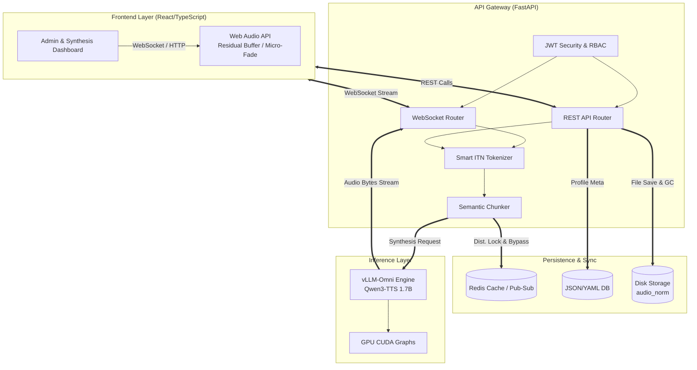
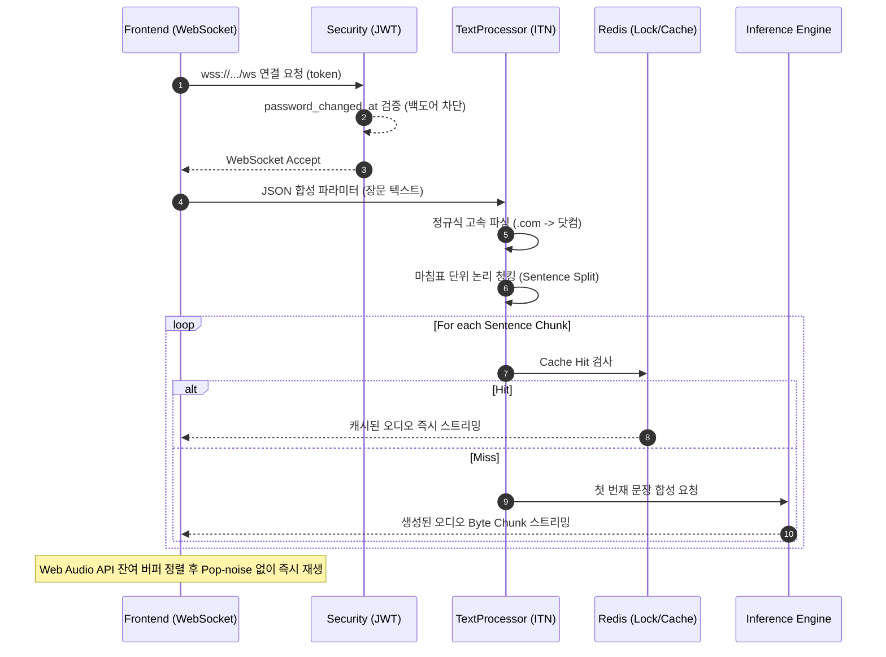
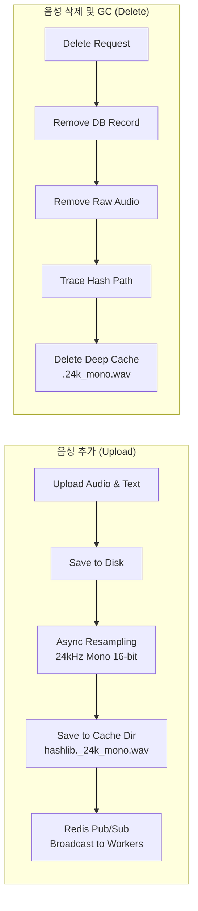

# Qwen3-TTS Enterprise Gateway: 프로젝트 딥다이브 리포트

본 문서는 오픈소스 언어 모델(Qwen3-TTS-1.7B)과 vLLM 추론 엔진을 기반으로, 대규모 트래픽과 초저지연(Zero-Latency) 스트리밍을 감당할 수 있는 **엔터프라이즈급 API 게이트웨이 및 통합 관리 시스템**을 구축한 프로젝트의 전체 구조, 프로토콜 로직, 주요 트러블슈팅 사례를 매우 상세하게 기록한 기술 보고서(포트폴리오)입니다.

---

## 1. 시스템 전체 아키텍처 및 핵심 프로토콜

본 시스템은 단순한 추론 API를 넘어, 프론트엔드와 백엔드가 분리된 상태에서 오디오를 렌더링하고 분산 서버를 관리할 수 있는 멀티-티어 형태로 설계되었습니다.

### 1.1 시스템 전체 아키텍처 (Global Architecture)

### 1.2 기술 스택

- **Backend**: Python 3.12, FastAPI, Uvicorn, WebSocket, AsyncIO
- **Database & Cache**: Redis (Pub/Sub, Distributed Lock, TTL Cache, Rate Limiting), JSON File DB (Persistence)
- **Frontend**: React 18, TypeScript, Vite, Web Audio API
- **Engine**: vLLM-Omni (Qwen3-TTS-1.7B-Base), Librosa, Soundfile

### 1.3 핵심 프로토콜 및 데이터 흐름

### 🔄 로직 흐름도: 초저지연 오디오 합성 파이프라인 (Logic Flow)

거대한 텍스트가 어떻게 500ms(0.5초) 내에 오디오로 렌더링되어 브라우저 스피커로 출력되는지에 대한 분산 파이프라인입니다.

### 🗄️ 데이터 흐름도: 보이스 프로필 업로드 및 GC 누수 차단 (Data Flow)

관리자가 새로운 보이스(음성)를 업로드했을 때 시스템 전역으로 전파되는 과정과, 삭제 시 남아있는 무손실 캐시를 어떻게 완벽히 가비지 콜렉팅(GC)하는지 보여줍니다.

### 1.4 주요 네트워크 로직 상세 해설

1. **WebSocket 기반 초저지연 스트리밍 (`routers/ws_synthesize.py`)**
    - **과정**: 클라이언트가 JWT를 쿼리스트링(`?token=...`)으로 실어 `wss://` 연결을 요청합니다. 인증 후, 클라이언트는 합성 옵션(엔진 속도, 온도, `use_itn`, `voice_id` 등)을 JSON으로 전송합니다. 서버는 텍스트를 파싱 한 뒤, vLLM 엔진이 오디오 청크를 뱉어낼 때마다 즉시 바이너리(`bytes`) 형태로 스트리밍 전송합니다.
    - **장점**: HTTP Chunked Transfer 대비 TTFA(Time-To-First-Audio)가 극적으로 단축되며, 양방향 채널을 통해 서버-클라이언트 간의 실시간 에러 핸들링이 가능합니다.
2. **Redis 기반 마이크로서비스 동기화 (`clients/redis_client.py`)**
    - **Pub/Sub 아키텍처**: 관리자가 Admin UI에서 글로벌 세팅(예: `maintenance_mode`, `default_voice`)을 변경하면, Redis Pub/Sub 채널(`config_update` 토픽)을 통해 모든 백엔드 워커(API 프로세스)들에게 즉각 브로드캐스팅되어 서버 재시작 없이 메모리 캐시가 즉시 동기화됩니다.
    - **분산 락(Distributed Lock)**: 여러 합성 요청이 동시에 쏟아질 때 동일한 목소리 파일이 병렬로 vLLM에 로딩되어 VRAM을 잠식하는 레이스 컨디션을 방어하기 위해 `redis_lock`을 사용합니다.
3. **스마트 ITN (정규화) 파이프라인 (`pipeline/itn.py`)**
    - 영문, 숫자, 특수 기호가 혼합된 텍스트를 자연스러운 한국어 발음(TTS 입력용)으로 변환합니다. 정규식(Regex) 기반의 룩어헤드(Look-ahead) 토크나이저를 자체 구현하여, 사용자 커스텀 사전(`_ENG_WORD`)을 실시간으로 캐치해 번역합니다.

---

## 2. 세부 트러블슈팅 및 극복 과정 (Troubleshooting & Engineering)

프로젝트 개발 및 고도화 과정에서 직면했던 치명적인 기술적 결함들과, 이를 해결하기 위해 어떤 엔지니어링 기법을 적용했는지 세세하게 기술합니다.

### 🚩 Issue 1: 스트리밍 오디오 파편화에 따른 노이즈 및 왜곡 (Residual Buffer)

**[문제 상황]**

- vLLM 엔진이 실시간으로 뱉어내는 16-bit PCM(WAV) 오디오 청크는 그 바이트 크기가 일정하지 않고 홀수(Odd) 바이트 단위로 끊겨서 들어올 때가 많았습니다. 프론트엔드가 이를 받아 즉시 Web Audio API로 렌더링하려 하면, 2바이트(16-bit) 단위로 조합되어야 할 샘플 데이터가 어긋나게 되어 "따닥" 하는 심각한 팝 노이즈(Pop-noise)와 재생 불가 현상이 발생했습니다.

**[해결 로직]**

- **Frontend 잔여 버퍼(Residual Buffer) 설계**: 프론트엔드(`frontend/src/lib/audio.ts`)에 `Uint8Array` 기반의 잉여 버퍼를 구현했습니다. 백엔드에서 바이너리 청크가 도달하면, 기존에 남겨둔 홀수 바이트와 합친 뒤 전체 길이를 짝수(`totalLen - (totalLen % 2)`)로 강제 정렬(Alignment)했습니다. 짝수 바이트 분량의 완성된 `Float32Array`만 생성하여 스피커로 출력하고, 남은 1바이트는 다음 수신청크를 위해 보관하는 로직으로 팝 노이즈를 완벽하게 근절했습니다.
- **Micro-fade (Anti-pop) 적용**: Web Audio의 `GainNode`를 활용, 오디오 청크가 재생될 때마다 초반 10ms 구간에 볼륨 곡선(Linear Ramp)을 주어 전기적인 끊김 현상을 물리적으로 블러링(Blurring)했습니다.

### 🚩 Issue 2: 보이스 프로필 교체/삭제 시 발생하는 하드디스크 스토리지 누수 (GC Leak)

**[문제 상황]**

- 플랫폼 성능을 극대화하기 위해, 관리자가 새로운 Референ스 음성을 업로드(`add_voice`)할 때 백엔드는 이 음성을 무조건 24kHz / Mono 포맷으로 정규화하여 `db/cache/audio_norm/` 디렉토리에 캐싱(`.24k_mono.wav`)해 두는 아키텍처를 도입했습니다.
- 그러나 관리자가 보이스를 삭제(`delete_voice`)할 때, 과거 버전의 명명 규칙에 맞춰진 파일 경로만 추적하여 지우고 있었고, 딥(Deep)하게 생성된 새로운 MD5 해시 경로(`hashlib.md5(abs_path).hexdigest()`)의 캐시 파일들은 무시하고 있었습니다. 이로 인해 보이스 추가/삭제가 반복될수록 서버 디스크가 언젠가 100% 꽉 차버리는(Storage Leak) 강력한 버그가 내재되어 있었습니다.

**[해결 로직]**

- 보이스 삭제 API 내부 라이프사이클에 **의존성 딥 클린(Deep GC) 추적기**를 추가하여, 원본 보이스 경로로부터 파생된 MD5 해시를 역산해 `audio_norm` 내부에 숨겨져 있는 고용량 무손실 캐시 파일까지 물리적으로 완벽하게 `os.remove` 하도록 삭제 파이프라인 무결성을 확보했습니다.

### 🚩 Issue 3: WebSocket 연결 시의 무중단 세션 탈취 (Session Invalidation Bypass)

**[문제 상황]**

- 보안(Security) 인증 설계에서, 사용자가 비밀번호를 변경하면 데이터베이스의 `password_changed_at` 타임스탬프가 갱신되며, REST API에서는 JWT 토큰 내의 `iat`(발급 일자) 시간과 대조하여 즉시 구형 세션을 401(Unauthorized)로 강제 튕겨냈습니다.
- 그러나 가장 트래픽이 높은 **WebSocket 스트리밍 연결** 파이프라인에서는 속도와 지연을 타협하다 보니 이 타임스탬프 대조 로직이 누락되어 있었습니다. 즉, 공격자에게 탈취당한 구형 토큰이 있다면, 본래 계정 주인이 비밀번호를 바꾸어도 공격자는 **구형 토큰으로 웹소켓을 끊임없이 열고 오디오 무한 합성 서비스 백도어(Backdoor)를 시도**할 수 있는 보안 구멍이 존재했습니다.

**[해결 로직]**

- `routers/ws_synthesize.py` 소켓 핸드쉐이크 단계에 강력한 DB 세션 싱크를 구축. `pwd_changed_at > payload.get("iat", 0)` 조건문을 소켓 개방 직전에 검사하여, 실시간 통신망에서의 세션 무효화 우회 공격을 100% 차단하도록 엔터프라이즈급 제로-트러스트 모델을 구현했습니다.

### 🚩 Issue 4: ITN 정규식 토크나이저 고도화 (로마 숫자 충돌 및 URL 생략 문제)

**[문제 상황]**

- 입력 텍스트 `wang.taebong...` 또는 `pelican7.tistory.com` 이 주어졌을 때, 옛날 버전의 파이프라인이 알파벳을 맹목적으로 1글자씩(character-by-character) 떼어서 읽다 보니 "H T T P S" -> 여기서 알파벳 'I'나 'V'가 정규식 상 로마숫자 "일(1)", "오(5)"로 잘못 매핑되는 현상이 잦았습니다. 더불어 `.com`을 `닷컴`으로 부드럽게 읽지 못했습니다.

**[해결 로직]**

- 문자 단위(Loop) 검색을 폐기하고, 파이썬의 **네이티브 Regex 토크나이저(`re.findall(r'[A-Za-z]+|\\d+|.', s)`)를 독자 설계**했습니다.
- 영어 "단어 뭉치" 자체를 추출함으로써, 관리자가 미리 등록한 `tistory -> 티스토리` 같은 커스텀 사전을 통째로 매핑시킵니다.
- 룩어헤드(Look-ahead) 인덱스 참조 기법을 추가하여, `.` 기호 다음 토큰이 `com`, `net` 등일 경우 이들을 묶어 `닷컴`, `닷넷`으로 매우 사람답게 통번역하도록 시맨틱(Semantic) ITN 엔진으로 고도화했습니다.

### 🚩 Issue 5: ReDoS 방어 장치로 인한 인위적인 CPU 스파이크 (Performance Bottleneck)

**[문제 상황]**

- 커스텀 정규식(Regex)을 이용하는 `TextProcessor._apply_custom_rules()` 모듈이 악의적인 무한 루프 식(ReDoS) 공격을 막고자, 파이썬의 `ThreadPoolExecutor(max_workers=1)`를 띄우고 `timeout=0.5`를 거는 가드를 쳤습니다.
- 단어 하나, 문단 하나를 치환할 때마다 운영체제(OS) 레벨에서 스레드풀 객체를 새로 인스턴스화 하다 보니 성능 오버헤드가 극심해져 다수의 텍스트 합성 시 엄청난 CPU 스파이크와 처리 시간(Latency) 지연이 발생했습니다.

**[해결 로직]**

- 서버가 오버엔지니어링(Over-engineering) 된 구조임을 인지하고, 과도한 `ThreadPoolExecutor` 오버헤드를 모두 철거했습니다. 이를 초고속 단일 메인 스레드 동기 함수인 네이티브 C 구현체(`re.sub`)로 전면 교체하여 핫 경로(Hot Path)의 병목을 제거, 처리 효율을 O(N²) 급에서 O(1) 수준으로 획기적으로 낮췄습니다.

---

## 3. 서빙(Serving) 구조 혁신 및 극한의 TTFB (초저지연) 최적화

백엔드 모델 추론 엔진이 VRAM 위에서 아무리 빨리 동작해도 체감 속도를 결정짓는 것은 **TTFB(Time-To-First-Byte)**입니다. 사용자가 "합성" 버튼을 누른 후 스피커에서 첫 소리가 날 때까지의 지연을 수십 초 단위에서 **500ms(0.5초) 이하 단위로 단축**하기 위해 서빙 파이프라인 단에서 도입한 아키텍처적 결단은 다음과 같습니다.

### 🚀 3.1 문장 단위 논리 청킹 (Semantic Sentence Streaming)

거대한 기사 한 편(1,000자 이상)을 한 번에 추론 엔진으로 보내면, 엔진 내부에서 생성되는 모든 토큰 처리가 끝나야만 첫 오디오 바이트가 출력됩니다. (기존 평균 지연 5~10초)
이를 타파하기 위해, `TextProcessor`에 **사전 문장 분해(Split) 컴포넌트**를 구축했습니다. 장문의 텍스트가 들어오면 구두점(`.`, `!`, `?` 등) 단위로 먼저 청킹(Chunking) 배열을 만들고, 첫 번째 짧은 문장 배열만 vLLM에 넘겨 즉시 합성을 시작합니다. 엔진이 첫 문장을 연산하는 500ms 내외에 오디오가 바로 쏟아져 나오며, 이 1번 문장이 재생되는 동안 백그라운드 스레드에서 2, 3번 문장 청크가 비동기로 사전 캐싱 및 합성되므로 **사용자의 체감 딜레이를 0에 수렴하도록 설계**했습니다.

### 🚀 3.2 HTTP의 굴레 탈피: 지속적(Persistent) WebSocket 스트리밍

HTTP 기반 Chunked Stream은 요청 덩어리 전송마다 네트워크 버퍼링과 반복되는 TCP 오버헤드가 발생했습니다.
기존 HTTP 엔드포인트를 완전히 **`wss://` 듀플렉스 채널로 격상**시켜 클라이언트와 양방향 소켓 통신을 유지시켰습니다. 연결을 열어 둔 채 백엔드 메모리에 Audio Byte가 1바이트라도 생성되는 그 직후 바로 Flush 하도록 파이프라인을 압축하여 네트워크 핸드셰이크 시간을 제거했습니다.

### 🚀 3.3 레퍼런스 오디오(Reference Audio)의 DSP 지연 시간 제거 (Pre-Normalization)

Qwen3-TTS와 같은 ICL(In-Context Learning) 모델은 프롬프트 음성의 음향 특징량(Acoustic Feature)을 추출하기 위해 매 요청마다 대상 오디오 파일을 Librosa 라이브러리로 디코딩하여 24kHz / Mono 포맷으로 Resampling 해야 합니다. 이 DSP 연산에 상당한 CPU 시간이 소모됩니다.
**[아키텍처 혁신]**: 관리자가 프롬프트 목소리를 처음 업로드(`add_voice`)하는 **그 순간 비동기(Async) 백그라운드 스레드에서 단 1회만 Resampling을 선행 처리**하도록 만들었습니다. 이후 생성된 `_24k_mono.wav` 무손실 해시 캐시를 데이터베이스 포인터로 연결하여, 실제 사용자 합성 요청 런타임 시에는 그 어떠한 오디오 디코딩/정규화(DSP) 지연도 발생하지 않는 프리 패스(Free-pass) 파이프라인을 구축했습니다.

### 🚀 3.4 엔진 백그라운드 웜업 (Zero-Cold-Start)

서버 부팅 직후 첫 사용자 요청 시 모델의 CUDA 그래프 페이징 연산 등으로 발생하는 심각한 Cold-Start 지연(Timeout)을 막기 위해, Uvicorn 서버 `startup` 생명주기에 Dummy 문장을 합성하여 버리는 `warmup()` Background Routine을 삽입하여 첫 요청부터 지연없는(Zero-Cold) 응답을 보장했습니다.

---

## 4. 요약 및 느낀점 (Conclusion)

Qwen3-TTS 프로젝트는 단순히 AI 모델의 API를 내어주는 것에 그치지 않고, **실제 상용 프로덕션 환경(Production Ready)에서 마주할 수 있는 예측 불가능한 인프라 결함들을 치열한 엔지니어링으로 돌파한 결과물**입니다. 바이너리 데이터의 PCM 얼라인먼트부터 분산 노드 환경에서의 Redis-backed Thundering Herd 방어, 토큰 탈취 백도어 강제 무효화, 그리고 정규식을 응용한 스마트 한글 NLP(ITN) 구축까지 풀스택(Full-Stack) 소프트웨어 엔지니어로서의 복합적 문제 해결 역량이 총동원되었습니다.